# Lab 10 - taskflow CI/CD architecture (one page)

Two pipelines, one repository (`backend/` = taskflow-api, `frontend/` = taskflow-mobile).
Every build/test stage runs in an **ephemeral Kubernetes pod** on the kind cluster (Jenkins cloud `kind`, namespace `jenkins-agents`).
Jenkins metrics feed Prometheus/Grafana (Lab 09), and the API pipeline reads them back in the Health Gate.

```mermaid
flowchart LR
  dev([git push / PR]) --> gh[GitHub webhook] --> mb{{Jenkins multibranch}}

  subgraph API["taskflow-api  (Jenkinsfile, pod ci/k8s/api-pod.yaml)"]
    direction LR
    a0[Install] --> par1
    subgraph par1["Checks (parallel, fail fast)"]
      direction TB
      g1[Secrets: gitleaks]
      g2[Lint: eslint]
      g3[SAST: eslint-security]
      g4[SAST: semgrep]
      g5[SCA: npm audit]
      g6[Unit tests + coverage]
    end
    par1 --> par2
    subgraph par2["Supply chain (parallel)"]
      direction TB
      s1[SBOM syft + cosign sign/verify]
      s2[Policy Gate: OPA]
    end
    par2 --> q1[SonarQube] --> q2{Quality Gate}
    q2 --> e2e[E2E: API + postgres sidecar + Playwright]
    e2e --> b1[Build image: kaniko, tag = commit SHA] --> b2{Trivy scan}
    b2 --> d1[Blue/Green deploy + smoke test<br/>auto-rollback on failure]
    d1 --> st[Deploy Staging<br/>branch develop]
    d1 --> hg{Pipeline Health Gate<br/>Prometheus success rate >= 90%<br/>branch main}
    hg --> ap[/Human approval/] --> prod[Deploy Production]
  end

  subgraph MOB["taskflow-mobile  (frontend/Jenkinsfile, pod ci/k8s/mobile-pod.yaml)"]
    direction LR
    m0[flutter pub get] --> par3
    subgraph par3["Checks (parallel, fail fast)"]
      direction TB
      m1[flutter analyze]
      m2[flutter test --coverage]
      m3[SCA: osv-scanner]
    end
    par3 --> m4[Debug APK<br/>every branch] --> m5[Signed release AAB<br/>main only, keystore from credentials<br/>jarsigner verify]
  end

  mb --> API
  mb --> MOB
  API & MOB -.metrics.-> prom[(Prometheus)] -.-> graf[Grafana SLO dashboard]
  prom -.alerts.-> am[Alertmanager]
  prom -. success rate .-> hg
  API & MOB -.success / failure.-> mail[Email: branch + build URL]
```

| Gate (blocks the pipeline) | Pipeline | Stage |
|---|---|---|
| Leaked secret in git history | API | Secrets Detection |
| Lint / SAST findings | API | Lint, SAST - ESLint, SAST - Semgrep |
| Critical dependency CVE | API | SCA (marks red) + Policy Gate (blocks) |
| Failing unit or E2E test | API, mobile | Unit Test, E2E, Test + Coverage |
| Coverage below 70% / new issues | API | Quality Gate (SonarQube) |
| Fixable HIGH/CRITICAL in image | API | Container Scan (Trivy) |
| New colour fails health check | API | Blue/Green Deploy (auto-rollback) |
| Pipeline success rate < 90% | API | Pipeline Health Gate |
| No human approval | API | Deploy - Production |
| Analyzer error / vulnerable package | mobile | Analyze, SCA - osv-scanner |
| Unsigned or debug-signed release | mobile | Build Signed Release AAB (jarsigner verify) |

Credentials used (Jenkins store, never in the repo): `github-pat`, `cosign-key`, `cosign-password`,
`kubeconfig-kind`, `kind-kubeconfig` (cloud), SonarQube token (server config), `android-keystore`,
`android-keystore-password`, SMTP login (Mailer config). CI database credentials: Kubernetes Secret `taskflow-ci-env`.
